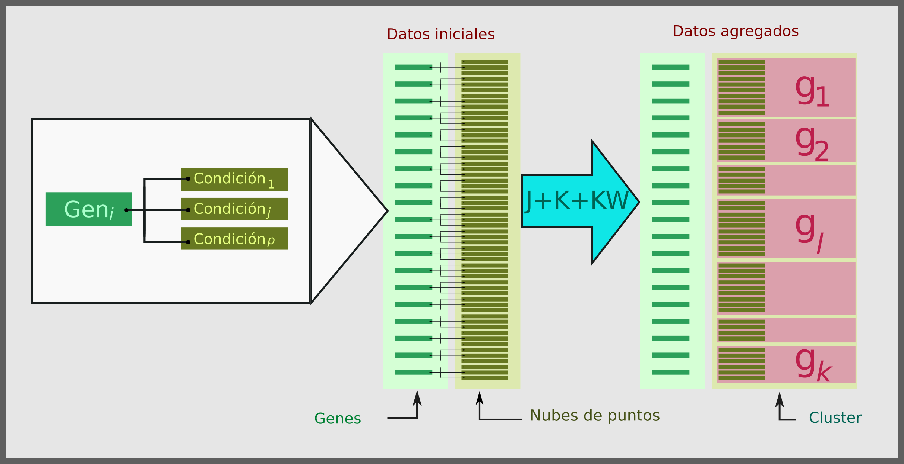

# Introducción

Dando continuidad al documento global, el presente capítulo aparece como una segunda iniciativa de implementación con datos reales; con el fin de establecer y consolidar la idea de muchas y diversas implementaciones de los métodos propuestos. El capítulo corresponde a una incursión en el área de la estadistica genómica, en particular el abordaje del problema de expresión diferencial en genes, que será explicado en detalle más adelante. Es pertinente aclarar que los métodos J-nubes y K-nubes no fueron diseñados en el ámbito teórico de la estadística genómica, por lo que no son propiamente métodos genómicos; sin embargo, su aplicación puede contribuir a resolver el problema de la expresión diferencial.

El proceso de expresión génica consiste en la manifestación de un gen o grupo de genes que se van a transcribir y traducir; a su vez, el análisis de la expresión génica se define como la determinación de patrones de genes expresados a nivel de la transcripción bajo circunstancias específicas o en células específicas [@Information]. Para el estudio de la expresión génica existen dos tecnologías: la secuenciación del RNA y el análisis de microarreglos, siendo este último el que presenta en la actualidad una cantidad mayor de propuestas de análisis, debido a que es más popular que la de secuenciación del RNA (RNAseq) [@Zhao2014].

Dadas las caracteristicas de los datos que se obtienen en los experimentos de microarreglos se pueden presentar datos con ruido y outliers. Además la cercanía entre los genes pueden interferir en la identificación de los mismos y por ello representan un desafío a nivel estadistico y computacional al momento de aplicar metodologías para identificar genes expresados diferencialmente [@Jiang2004]. 

Adicionalmente es posible aplicar metodologías de clustering que permitan entender las funciones de los genes, la regulación génica y los procesos celulares, además los genes que presenten patrones similares de expresión pueden ser agrupados junto con las funciones celulares que estos desempeñen [@Jiang2004]. 

Así pues el propósito de este capítulo es abordar el problema de la expresión diferencial mediante el método J-nubes, comparando los resultados obtenidos con el método SAM (Significance Analysis of Microarrays) [@Chu2011] y haciendo uso de acde (Artificial Components Detection of Differentially Expressed Genes) [@Acosta2015] como visualización. Primero se explora el tema de clustering en datos genómicos, desarrollado en gran parte usando microarrays; luego se presentan los métodos, aclarando en detalle el ejercicio; una breve sección de resultados conduce a un análisis sucinto de los mismos.

# Antecedentes

## Microarreglos 

El análisis de microarreglos es una técnica de biología molecular desarrollada en los años 90 que ha estado enfocada en el análisis de colecciones de datos genéticos y se ha utilizado para monitorear la expresión génica de miles de genes de forma paralela, utilizando matrices para análisis miles de transcritos génicos y dando la posibilidad de responder a una amplia gama de problemas biológicos, como la identificación de genes expresados diferencialmente entre tejidos enfermos y sanos, a evolución de la regulación génica y la respuesta a fármacos entre otros. Los experimentos aplicados con mayor frecuencia son microarreglos con cDNA (Copia de ADN) y los microarreglos de nucleótidos conocidos como oligochip [@Jiang2004][@Zhao2014].

La técnica pretende medir el nivel de expresión del ADN por medio de la relación entre la señal de prueba de la muestra y la muestra control, que han sido previamente marcadas con un fluorocromo. Tanto la muestra como el control son marcados con fluorocromos y montados en un chip leído a través de una plataforma de microarreglos [@Jiang2004].

Generalmente los experimentos de microarreglos cuentan con datos de 1000 a 10000 genes (pueden ser más, ya que los chips pueden ser diseñados) pero con un número de muestras usualmente menores a 100 [@Jiang2004].

Entre las limitaciones de estas técnicas está el background de la hibridización, que limita la exactitud de las mediciones de expresión particularmente a los transcritos de baja frecuencia, los datos muchas veces son susceptibles al ruido dado que las mediciones dependen de la emisión de luz de las sondas marcadas y pueden generar de por sí falsos positivos. La identificación clara de outliers que son datos  obtenidos por respuesta experimental de los organismos a las condiciones expuestas se ve limitada por el ruido experimental de los datos [@Jiang2004][@Zhao2014]. 

## Clustering en datos genéticos

Existen tres modelos de clustering que han sido aplicados para el análisis de datos de microarrelgos, tales modelos como son [@Jiang2004]: 

1. Clustering basado en genes, donde los genes son tratados como objetos mientras que las muestras (o condiciones) son tratadas como características y cada grupo corresponde a un fenotipo. 

2. Clustering basado en la muestra: Las muestras son tratadas como objetos y los genes como características.

3. Subespacio de clustering: Donde se toman los clusters formados por un subset de genes de una muestra, esto dado al principio biológico de que solo un grupo pequeño de genes participan en cualquier proceso celular de interés y se lleva a cabo por un subconjunto de muestras.

## Medidas de proximidad.

Entre las medidas de proximidad utilizadas para este tipo de análisis se encuentran: la distancia eclidiana, que presenta el inconveniente de que no puntúa bien los datos escalonados de expresión génica. El coeficiente de Pearson es el la medida más popular para el análisis de este tipo de datos pues ofrece una medición efectiva para los datos de expresión génica pero no es robusto con los outliers y puede generar falsos positivos cuando se asigna un puntaje de alta similariadad. Otra media es la correlación de Jackknife que elimina los outliers evitando la “dominación” pero implica la enumeración de diferentes combinaciones de características para luego eliminarlas, lo que hace que computacionalmente sea costo.  Finalmente esta la correlación de Sperman ya que no requiere una distribución Gaussiana y es muy robusta para trabajar los outliers pero presenta el inconveniente de la perdida de datos [@Jiang2004].   

## Desafíos del clustering de genes. 

La utilización de tecnicas de clustering para el analisis de expresión diferencial en datos obtenidos a partir de microarreglos son [@Jiang2004]:

1. Los algoritmos a utilizar deben depender lo menos posible del conocimiento previo, para poder visualizar las estructuras de los datos y poder visualizar la distribución de los mismos.

2. Los datos de microarreglos contienen mucho ruido, por lo tanto los algoritmos deben ser capaces de extraer información útil en esa condición.

3. Los datos están altamente conectados entre sí,  por lo tanto los algoritmos deben ser capaces de manejar esta situación.

4. A nivel biológico podría no ser de interés los clusters de los genes, pero sí la relación entre los clusters y la relación de los genes dentro del mismo clusters, por lo tanto los algoritmos deben ser capaces de particionar los datos sino que también de mostrar una estructura gráfica del cluster.

## Análisis de expresión diferencial.

El análisis de expresión diferencial consiste en el uso de técnicas estadísticas con el fin de encontrar genes diferencialmente expresados. Mediante las técnicas mencionadas es posible realizar mediciones de un gen en dos o más condiciones distintas, teniendo como objetivo establecer si estas mediciones presentan cambios estadísticamente significativos explicados por las distintas condiciones; un gen con cambios estadísticamente significativos en distintas condiciones se denomina diferencialmente expresado.

En este sentido, es adecuado plantear una prueba de hipótesis de localización, con el fin de evaluar las diferencias mencionadas; cuya sensibilidad depende de la cantidad de mediciones que se realizan en cada condición. Sin embargo, usualmente los conjuntos de datos corresponden a la estructura anterior replicada en grandes cantidades de genes (diez, quince, veinte mil genes [@Jiang2004]).

En este panorama el uso de pruebas de hipótesis a nivel individual pierde vigencia; la estructura teórica del concepto de significancia debilita la realización pruebas de hipótesis en tales cantidades; pues, el aumento en el número de pruebas conduce al aumento del error tipo I, requiriendo correcciones como la de Bonferoni [@DUNN], y, en general, estimulando la creación de estrategias apropiadas para abordar el problema en toda su complejidad.

Una de las propuestas más recientes en detección de genes diferencialmente expresados es el método SAM. A partir de un conjunto de genes de un experimento de mircroarreglos, el método calcula un $d_i$ para cada gen $i$, y mide la relación entre la expresión génica y la variable respuesta, iterando sobre permutaciones de los datos para determinar si la expresión de un gen se relaciona significativamente con la respuesta; el punto de corte de la significancia está determinado por un parámetro de ajuste $\delta$, definido por el usuario en base a la tasa de falsos positivos [@Chu2011]. 

Otra propuesta es acde  que provee un análisis multivariado para la detección de genes expresados diferencialmente. Esta utiliza componentes artificiales omo estadísticos de prueba para la detección de genes diferencialmente expresados facilitando la interpretación exacta en términos de expresión génica diferencial y controlando los FDR (false Discovery rate). Adicionalmente calcula los límites de confianza para iniciar el FDR y el uso de relaciones de inercia [@Acosta2015].

# Materiales y métodos

## Datos a utilizar.

```{r instaling, eval = FALSE, include = FALSE, echo=FALSE}
source("https://bioconductor.org/biocLite.R")
biocLite("samr")
biocLite("acde")

```


```{r, include = FALSE}
library("samr")
library("acde")
library("FactoMineR")
library("reshape2")
library("knitr")
library("dplyr")
library("magrittr")
library("ggplot2")
library("Rcpp")
library("ggdendro")
library("scales")


data("phytophthora")

sourceCpp("distancia.cpp")

opts_chunk$set(echo = FALSE, include = FALSE, eval = TRUE, cache = TRUE, fig.width = 5, fig.height = 5)

```


Gene expression data for 16 tomato plants (line IL6-2) in field conditions. 8 of these plants were inoculated with Phytophthora infestans, and the other 8 were mock-inoculated with sterile water. Leaf tissue samples from each replicate were taken at 12 hours before and 12, 36 and 60 hours after inoculation. We refer to 12 hours before inoculation as the h0 time point. Expression levels were obtained for 13440 genes.

Los datos `phytophthora` contienen 4 matrices (`r names(phytophthora)`) de datos de expresión génica para 16 plantas de tomate (línea IL6-2) en condiciones de campo, publicados en la libreria ACDE [@Acosta2015]. 8 plantas fueron inoculadas con Phytophthora infestans y otras 8 fueron inoculadas con agua estéril. Se tomaron muestras de tejido foliar de cada réplica 12 horas antes de la inoculación y 12, 36 y 60 horas después de la inoculación. Se ha etiquetado la muestra tomada 12 horas antes de la inoculación como el punto de tiempo 0h. Los niveles de expresión fueron obtenidos para 13440 genes.

En este estudio se analizan únicamente los datos correspondientes a la última medición, 60 horas después de la inoculación.

## Software

Todo el análisis se realiza en el software estadístico R [@R] usando paquetes de Bioconductor, entre ellos los paquetes acde y samr.

## Propuesta de análisis.

Entonces, el análisis propuesto para los datos comprende los siguientes puntos.

 - **Visualización:** Es necesario encontrar estrategias de visualización adecuadas para evaluar el desempeño de los métodos evalueados. En este sentido el acde resulta una herramienta propicia para la visualización de los resultados.
 - **SAM:** La expresión diferencial de los genes es evaluada mediante el método SAM ya mencionado.
 - **J-nubes:** El algoritmo J-nubes es usado para evaluar la expresión diferencial en genes.

Los resultados obtenidos usando J-nubes son comparados con los obtenidos mediante SAM; no con el objeto de establecer cuál se comporta mejor sino de verificar la identificación correcta de los genes suponiendo correctos los resultados de SAM.

La aplicación del algoritmo J-nubes a los datos descritos requiere la prepareación adecuada de los mismos. Cada gen en cada condición es considerado una nube de puntos; así, siendo $n$ genes y $p$ condiciones se tiene $n\times p$ nubes de puntos. Este conjunto de nubes de puntos produce una matriz de distancias^[son distancias entre nubes de puntos con nombre propio de cramervonmises corregidas, corregir o alcarar o algo.] de $(n\times p)^2$ entradas, esta matriz es insumo del algoritmo J-nubes que, como se ha explicado, corresponde al método de Ward de mínima varianza para agregación jerárquica. Empleando el diagrama de árbol se escoge un número $k$ de grupos cuya homogeneidad interna se evalúa a la luz de la prueba Kruskal-Wallis. La figura PPX da un repaso a este primer paso de agregación.



Utilizando la prueba de Mann-Whitney-Whilcoxon es posible realizar todas las comparaciones posibles de los grupos conformados, corrigiendo según Bonferroni. De esta manera se comparan los valores un gen $i$ en una condición $j_1$ con sus valores en otra condición $j_2$ estableciendo su pertenencia a grupos $g_1$ y $g_2$ significativamente distintos o no. La validación de los grupos se realiza mediante el test de Kruskall Wallis [@KWTEST] y se comparan con los resultados provenientes de SAM y de acde.

# Resultados 

```{r}
set.seed(34567)
Muestra <- phytophthora[[4]]
names_datos <- names(Muestra)
des <- rep(c(1,2), each = 8)
tamano <- 1000
Muestra[sample(nrow(Muestra), tamano),] -> Muestra

```

El conjunto de datos tiene `r nrow(phytophthora[[4]])` elementos. Por facilidad computacional se selecciona una muestra de tamaño `r tamano`. Todos los análisis se realizan sobre esta.

```{r}
evaluated_ecdf <- function(categories, values){

  # a vector with sorted and unique values
  unique(values) -> .
  sort(.) -> ordenados

  # a list of functions, one function per category
  ecdf_categories <- tapply(X = values, INDEX = categories, FUN = ecdf)

  # a data.frame with the evaluations of the functions in the sorted values
  sapply(X = ecdf_categories, FUN = function(x, y){x(y)},
    y = ordenados) -> .
  t(.) ->.
  data.frame(.)->.
  set_colnames(., ordenados)
}

```

Como se dijo, se analizan únicamente los datos correspondientes a la última inoculación. A continuación vemos en un diagrama de caja el comportamiento de los datos.

```{r, fig.height = 3.5, fig.width=8, echo = FALSE, include = TRUE}
  par(font=1, las = 1, mar = c(2, 6, 2, 2))
boxplot(phytophthora[[4]], outline = FALSE, col="lightblue", cex.names = 0.2, 
    cex.names = 0.2, axes = FALSE, border = "#225566", horizontal = TRUE)
  axis(2, at = 1:16, labels = names_datos)
  axis(1)

```

Figura XTV: Mediciones realizadas en plantas infectadas y no infectadas.

En la gráfica se observan las distintas mediciones, se tienen 8 mediciones en plantas infectadas y otras 8 en plantas no infectadas.

## acde (Artificial Components Detection of Differentially Expressed Genes)

La metodología acde [@Acosta2015] plantea el cálculo de componentes artificiales, que en el caso de dos condiciones quedan definidos por la siguiente expresión:

\begin{gather}
\psi_1(x_i) = \sqrt{p} x_i \\
\psi_2(x_i) = \frac{\sqrt{p_1p_2}}{\sqrt{p_1 + p_2}} (x_{iTr} - x_{iC}) 
\end{gather}

```{r, ac}
Muestra %>% 
  ac(design = des) %>% as.data.frame -> 
  Muestra_ac

```

De esta forma los valores quedan resumidos en los ejes de los componentes artificiales $psi_1$ y $psi_2$. La figura XMM muestran la densidad estimada y el histograma en cada uno de los componentes artificiales.

```{r, fig.height = 2.5, fig.width=8, include = TRUE}
Muestra_ac %>% 
  ggplot + aes(x = psi1, y = ..density..) +
  geom_histogram(binwidth = 1, fill = "#224466", alpha = 0.5) +
  geom_density(colour = "#335566") + labs(x = "", y = "") +
theme_minimal()

```

```{r, fig.height = 2.5, fig.width=8, include = TRUE}
Muestra_ac %>% 
  ggplot + aes(x = psi2, y = ..density..) +
  geom_histogram(binwidth = 1, fill = "#224466", alpha = 0.5) +
  geom_density(colour = "#335566") + labs(x = "", y = "") +
theme_minimal()

```

Figura XMM: Densidad estimada e histograma de los valores generados.

Es notorio como mientras el primer componente artificial presenta valores muy cercanos a cero y una coa muy pesada a derecha, el segundo componente presenta ambas colas pesadas y una gran concentración de los datos en el centro de la distribución. Esto queda explicado en el gráfico bivariado de los componentes, figura XPG, donde se examina la proyección de los genes en sus componentes artificiales; amén del resultado del procedimiento de Single Time Point Analysis, que determina un $\alpha^*$ óptimo que controla la taza de falsos positivos (FDR), determinando genes expresados, inhibidos y remanentes.

```{r, fig.width = 8, fig.height = 2.5, include = TRUE}
Muestra %>% stp(des, BCa = FALSE) -> stpPI
Muestra_ac %>% ggplot + 
  aes(x = psi1, y = psi2, colour = stpPI$dgenes) + 
  geom_point() + geom_hline(yintercept = 0) + 
  geom_vline(xintercept = 0) + 
  scale_color_manual(
    values = c("#aa0000", "#000000", "#00aa00"), 
    name="Expresión",
    breaks=c("up-reg.", "no-diff.", "down-reg."),
    labels=c("Expresados", "Remanentes", "Inhibidos")
  ) +
  theme_minimal()

```

Las frecuencias relativas de expresión, inhibición y no expresión están dadas en la siguiente tabla:

```{r}
stpPI$dgenes %>% table %>% "/"(tamano) %>% setNames(c("Inhibidos", "No expresados", "Expresados")) %>% as.data.frame %>% kable

```

Esta es la herramienta de visualización mediante la cual se examinan los resultados debidos a la aplicación del algoritmo propuesto J-nubes y de SAM.

## Aplicación J-nubes

```{r}
n.clusters <- 20

```

Se aplica el algoritmo generando `r n.clusters` grupos de genes en cada condición.

```{r}
to_nubepuntos <- function(a){
  data.frame(value = a, weight = 1/length(a)) -> nubepuntos
 class(nubepuntos) <- c("data.frame", "nubepuntos")
  nubepuntos
}

```

```{r}
# collapsa_nubes <- function(nube_list){
#   
#   sum(unlist(lapply(nube_list, nrow))) -> n_total
#   lapply(nube_list, function(nube){
#     nube$weight <- nube$weight*nrow(nube)/n_total
#     nube}) -> .
#   do.call(rbind, .) -> nubepuntos
#     class(nubepuntos) <- c("data.frame", "nubepuntos")
#   nubepuntos
# 
# }

list_outer <- function(a,b, fun) {
  outer(a, b, function(x,y) vapply(seq_along(x), function(i) fun(x[[i]], y[[i]]), numeric(1)))
}

list_auto <- function(a, fun){list_outer(a, a, fun)}

auto <- function(a, fun){fun(a, a)}

```

```{r}
D_def <- function(nube_0, nube_1){
  rbind(
    cbind(nube_0, binary = 0),
    cbind(nube_1, binary = 1)
  ) -> tmp
  
  # sqrt(min(nrow(nube_0), nrow(nube_1))) * distan_np(tmp[order(tmp$value),])
  distan_def(tmp[order(tmp$value),])
}

```

```{r}
list(cond_1 = 1:8, cond_2 = 9:16) %>% 
  lapply(
    function(cual){
      "["(Muestra, cual) -> x
      setNames(x, letters[1:8]) -> x
      mutate(x, gen = rownames(x))
      }) %>% Map(data.frame, ., cond = c("cond_1", "cond_2"), stringsAsFactors = FALSE) %>% do.call(rbind, .) %>% melt(c("cond", "gen")) %>% mutate(cond_gen = paste(cond, gen, sep = "_")) -> muestra_nueva

muestra_nueva %$% split(value, cond_gen) %>% lapply(to_nubepuntos) -> nubes

```

```{r, eval = FALSE}
# start.time <- Sys.time()
# nubes %>% list_auto(D_def) %>% as.dist -> dis_matriz
# end.time <- Sys.time()
# time.taken <- end.time - start.time
# time.taken

# save(dis_matriz, file = "gen_dis_matriz.rda")

```

```{r, fig.width=8, fig.height=2.5, include = TRUE}
load(file = "gen_dis_matriz.rda")

dis_matriz %>% hclust(method = "ward.D") -> tree

# plot(tree)

ggdendrogram(tree, rotate = TRUE) + theme(axis.text.y = element_blank())


tree %>% cutree(n.clusters) -> grupos_genes

```

Figura XLS: Dendrograma de los genes arrojado por el algoritmo J-nubes.

Es necesario corroborar que los grupos psoeen homogeneidad interna. Como criterio para esta tarea utiliza la pruba de Kruskal-Wallis en cada grupo con una significancia individual de $\alpha/k$, que en este caso es igual a `r 0.05/n.clusters` para completar una significancia de $\alpha = 0.05$ en el procedimiento general. La figura XPQ mestra el p valor obtenido en cada grupo.

```{r, fig.width=8, fig.height=2.5, include = TRUE}
muestra_nueva %$% split(value, cond_gen) -> totales

list_for_kwtest <- split(totales, as.factor(grupos_genes))

lapply(X = list_for_kwtest, FUN = function(x){ifelse(length(x) == 1,1,kruskal.test(x)$p.value)}) %>% 
  unlist %>% data.frame %>% setNames("P_value") %>% mutate(grupo = reorder(as.factor(rownames(.)), as.numeric(rownames(.)), mean)) -> kwtest_pvalues

kwtest_pvalues %>% ggplot + aes(x = grupo, y = P_value) +
  geom_bar(stat = "identity") + 
  geom_abline(intercept = 0.005, slope = 0) + theme_minimal()

```

Figura XPQ: Valores p de la prueba Kruskal-Wallis en cada uno de los grupos.

Entonces, es posible afirmar que la partición obtenida está coonformada por clases internamente homogéneas. La figura XHG muestra la composición de los grupos. Llegado este punto, es necesario establecer el comportamiento entre grupos, detectando cuáles de ellos son estaditicamente distintos entre sí mediante la prueba de Mann-Whitney-Wilcoxon, aplicada a todas las posibles parejas; es decir $\binom{k}{2}$ veces.

```{r, fig.width=8, fig.height=2.5, include = TRUE}
grupos_genes %>% data.frame(grupo = ., cond_gen = names(.)) %>% merge(muestra_nueva) -> muestra_agrupada

muestra_agrupada %>% ggplot + aes(x = as.factor(grupo), y = value) + geom_boxplot() + theme_minimal()

muestra_agrupada %$% split(value, grupo) -> agrupados

# boxplot(agrupados)


```

Figura XHG: boxplot de los grupos formados mediante el algoritmo J-nubes.

Es en últimas mediante la prueba de Mann-Whitney-Wilcoxon que se realiza la comparción entre nubes de puntos correspondientes a genes en distintas condiciones. La figura XVB muesta los grupos que resultan distintos entre sí y los que no, con una significancia individual de $0.05/\binom{k}{2}$ que garantiza una significancia de $\alpha = 0.05$ en el procedimiento completo.

```{r, fig.width=6, fig.height=3, include = TRUE}
parejas <- choose(n.clusters, 2)

agrupados %>% list_auto(function(x,y){"[["(wilcox.test(x,y, exact = FALSE), "p.value")}) -> pvalues

pvalues %>% as.vector %>% data.frame(expand.grid(1:nrow(pvalues),1:nrow(pvalues))) %>% mutate(valor = factor(. < 0.05/parejas, labels = c("Iguales", "Diferentes"))) %>% ggplot + aes(x = Var1, y = Var2, fill = valor) + geom_raster() + theme_minimal() + labs(x ="", y = "", fill = "Diferencias significativas") + theme(legend.position = "bottom") + coord_fixed()

gen_p_value <- function(nombre_gen){
muestra_agrupada$cond_gen %in% paste(c("cond_1", "cond_2"), nombre_gen, sep = "_") %>% "["(muestra_agrupada,.,c("cond_gen", "grupo")) %>% unique %>% "[["("grupo") -> cuales
"["(pvalues, cuales[1], cuales[2])
} 

Muestra %>% rownames %>% lapply(gen_p_value) %>% unlist -> resultado

```

Figura XVB: Diferencias estadísticamente significativas entre los grupos.

Entonces, para comparar datos de distintas condiciones asociados a un mismo gen basta establecer si estos se encuentran en grupos con diferencias estadísticamente significativas o no. De esta forma es posible construir el diagrama correspondiente a la figura XMQ, que muestra los genes expresados y los no expresados. Las proporciones correspondientes se encuentran en la tabla XKJ.

```{r, fig.width=8, fig.height=2.5, include = TRUE}
mutate(Muestra_ac, Res = resultado) %>% ggplot + aes(x = psi1, y = psi2, colour = factor(Res < 0.05/parejas, labels = c("Iguales", "Diferentes"))) + geom_point() + geom_hline(yintercept = 0) + 
  geom_vline(xintercept = 0) + 
  scale_color_discrete(name = "Expresión") +
  theme_minimal()

```

Figura XMQ: Genes diferencialmente expresados, detectados mediante J-nubes, visualizados mediante acde.

```{r, include=TRUE}
(resultado > 0.05/parejas) %>% as.numeric %>% "+"(1) %>% "["(c("Expresados", "No expresados"), .) %>% table() %>% prop.table() %>% as.data.frame() %>% kable

```

Tabla XKJ: Proporciones de expresión génica encontradas mediante J-nubes.

## SAM (Significance analysis of microarrays)

Como se ha explicado, la comparación de los resultados del método propuesto J-nubes con los de la técnica SAM hace parte del propósito del capítulo. Teniendo en cuenta que los métodos propuestos no fueron diseñados en el ámbito de los datos genómicos, es necesario establecer qué tan coherentes son sus resultados con los obtenidos mediante otras técnicas.

```{r}
data <- list(
  x = Muestra,
  y = des, 
  geneid = as.character(1:nrow(Muestra)),
  genenames = paste("g", as.character(1:nrow(Muestra)), sep = ""), 
  logged2 = TRUE)

samr.obj<-samr(data, resp.type="Two class unpaired", nperms=100)

```

El algoritmo SAM requiere un parámetro $\Delta$ de afinación que permite controlar la tasa de falsos positivos. En este caso se corrió el algoritmo con $\Delta = 0.4$. Al realizar un Q-Q plot para los resultados del análisis se observan los genes diferenciados e inhibidos.

```{r, fig.width=5, fig.height=4, include = TRUE}
delta=.4
samr.plot(samr.obj, delta)

```

Figura XCR: Q-Q plot de los resultados del análisis SAM.

Haciendo uso, de nuevo, de los componentes artificiales es posible visualizar los genes; clasificados en expresados y no expresados gracias a los p valores calculados mediante SAM en la figura XZZ.

```{r, fig.width=8, fig.height=2.5, include = TRUE}
sam_pvalues <- samr.pvalues.from.perms(samr.obj$tt, samr.obj$ttstar)

Muestra_ac %>% 
 ggplot + 
  aes(x = psi1, y = psi2, colour = factor(sam_pvalues < 0.05, labels = c("Iguales", "Diferentes"))) + geom_point() + 
  geom_hline(yintercept = 0) + 
  geom_vline(xintercept = 0) + 
  scale_color_discrete(name = "Expresión") +
  theme_minimal()

```

Figura XZZ: Genes diferencialmente expresados, detectados mediante SAM, visualizados mediante acde.

La proporción de genes expresados es bastante diferente a los mostrados anteriormente: tabla XIY.

```{r, include = TRUE}
factor(sam_pvalues > 0.05, labels = c("Expresados", "No expresados")) %>% table %>% prop.table() %>% as.data.frame() %>% kable

```

Tabla XIY: Proporciones de expresión génica encontradas mediante SAM.

## Coincidencia

Los p-valores encontrados mediante J-nubes y los encontrados mediante SAM presentan un coeficiente de correlación de `r cor(resultado,sam_pvalues)`; una correlación fuerte, positiva y estadísticamente significativa. La figura XMY ilustra la relación entre ambos.

```{r, fig.width=8, fig.height=2.5, include = TRUE}
data.frame(J_nubes_p = resultado, SAM_p = sam_pvalues) %>% ggplot + aes(x = SAM_p, y = J_nubes_p) + stat_density2d(aes(alpha=..level.., fill = ..level..), geom="polygon", bins = 20) + ylim(-.5, 1.5) + theme_minimal() + labs(x="SAM: p-valores", y = "J-nubes: p-valores") + geom_point(size = 0.2) + theme(legend.position = "none") + geom_vline(xintercept = 0.05, colour = "#224455") + scale_fill_gradient(low = "#dddd00", high = "#dd0000")

```

Figura XMY: Scaterplot de pvalores de ambas técnicas. Es necesario agregar estimaciones de densidad bivariada para visualizar el peso de las regiones, dado que los puntos se superponen. La línea vertical se ubica en un $\alpha = 0.5$ destacando que casi todos los genes diferencialmente expresados detectados por SAM fueron también detectados por J-nubes.

Resulta pertinente además realizar una tabla de contingencia de la expresión diferencial en ambos métodos.

```{r}
table(SAM = factor(sam_pvalues < 0.05, labels = c("No expresados", "Expresados")), Jnubes = factor(resultado < 0.5/parejas, labels = c("No expresados", "Expresados"))) %>% prop.table()

```

Tabla XQG: Tabla de contingencia de la expresión diferencial.

# Análisis

El análisis de estos resultados es breve, pues se amplia en el capitulo de discusión de la tesis, haciendo alusión a los demás capitulos y dando contexto adecuado a los hallazgos.

La alta correlación entre los p-valores de las distintas pruebas es una noticia a favor del método J-nubes; de igual manera ocurre con los valores de la matriz de confusión: J-nubes detecta todos (99%) los genes diferencialmente expresados por SAM y otros cuantos más.

# Referencias